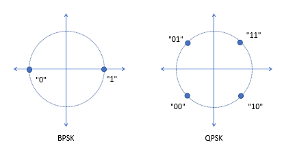
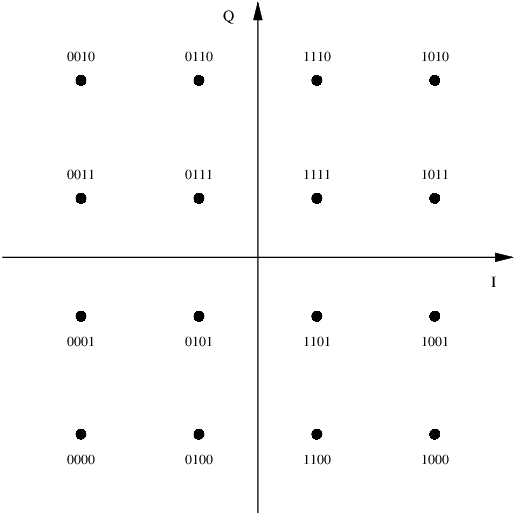

|[<<< Chapter 1](./Chapter1.md)|[Home](../README.md)|[Chapter 3 >>>](./Chapter3.md)|
|-|-|-|

# Chapter 2: NR design and terminologies

||
|:-:|
|5G NR frame structure and basic terminologies|

## 2.1. Frame structure, waveform, numerology

3GPP agreed to use OFDM (orthogonal frequency division multiplexing) with a CP (cyclic-prefix) for both DL (down-link) and UL (up-link) transmissions.

CP-OFDM help enable:
- Low implementation complexity
- Low cost for wide bandwith operations
- Multiple input multiple output (MIMO) technologies

5G NR also supports DFT (discrete Fourier transform) spread OFDM (DFT-S-OFDM) to improve coverage in UL transmissions.

NR defined 2 frequency ranges (FR):
- FR1 (sub-6 GHz): 450 MHz - 6GHz
- FR2 (millimeter wave): 24.25 GHz - 52.6 GHz

NR uses flexible subcarrier spacing of 2μ.15 kHz (μ = 0, 1,..., 4) scaled from the basic 15 kHz subcarrier spacing in LTE. Accordingly, the CP is scaled down by a factor of 2−𝜇 from the LTE CP length of 4.7 μs. This scalable design allows support for a wide range of deployment scenarios and carrier frequencies.

At lower frequencies, below 6 GHz, cells can be larger and subcarrier spacings of 15 kHz and 30 kHz are suitable. At higher carrier frequencies, phase noise becomes more problematic and in FR2, NR supports 60 kHz and 120 kHz for data channels and 120 kHz and 240 kHz for the SS/PBCH block (SSB) used for initial access. At higher frequencies, cells and delay spread are typically smaller and the CP lengths provided by the 60 and 120 kHz numerologies are sufficient.

A frame has a duration of 10 ms and consists of 10 subframes. Each subframe consists of 2𝜇 slots of 14 OFDM symbols each. Although a slot is a typical unit for transmission upon which scheduling operates, NR enables transmission to start at any OFDM symbol and last only as many symbols as needed for the communication (mini-slot).

## 2.2. Carrier, bandwidth, resource

In NR, a resource block (RB) comprises 12 subcarriers. NR's ultra-lean design minimizes always-on transmissions, boosting energy efficiency and reducing interference.

Millimeter wave operation benefits greatly from a low-frequency carrier for good coverage, especially in the uplink. NR uses carrier aggregation, similar to LTE, to combine spectrum across multiple bands. NR can overlap with LTE carriers, allowing dynamic spectrum sharing and easing the transition from LTE to NR. Solutions include NR PDSCH mapping around LTE CRS and flexible placement of DL control channels to avoid LTE signal collisions. NR also supports supplementary uplink (SUL) for low-band UL complement in high-frequency bands and supplementary DL (SDL) for DL-only spectrum use.

To ensure forward compatibility in NR, certain resource sets can be reserved, allowing future physical layer solutions for new use cases. Each 1 ms subframe's radio resources form a resource grid of subcarriers (frequency) and OFDM symbols (time), with each resource element (RE) occupying one subcarrier and one OFDM symbol.

||
|:-:|
|Narrow band and Wide band|

To reduce power consumption, user equipment (UE) may use wide bandwidth for short bursts and narrow bandwidth otherwise. This bandwidth adaptation is managed by the concept of bandwidth parts, subsets of contiguous resource blocks (RBs). Up to four bandwidth parts can be configured for each UL and DL, but only one is active per direction at a time. This allows the UE to switch dynamically between narrow and wide bandwidths as needed.

## 2.3. Modulation, Channel coding, Slot configuration

### 2.3.1. **Modulation schemes** with **Gray Coded** mapping
|||
|:-:|:-:|
|PSK|16-QAM|

- *Phase shift keying (PSK)*: Binary PSK (BPSK), Quadrature PSK (QPSK), or
- *Quadrature amplitude modulation (QAM)*: M = 16, 64, 256.

### 2.3.2. **Channels control**
||
|:-:|
|Channel Coding|

- *Reed-Muller block codes (RM codes)*, and
- *Cyclic redundancy check (CRC) assisted polar codes*.

### 2.3.3. **Data channels**
Use rate compatible quasi-cyclic low-density parity-check (LDPC) codes.

**Duplexing options**:
- *Frequency division duplex (FDD)*
- *Time division duplex (TDD)*:
    - *Semi-statically configured TDD*: for large over-the-rooftop cells
    - *Dynamic TDD*: or small/isolated cells

TDD operations are enabled by flexible slot configuration in NR. OFDM symbols in a slot can be configured as *DL*, *UL*, or *flexible*. DL transmissions can occur in *DL* or *flexible* symbols, and UL transmissions can occur in *UL* or *flexible* symbols. Cell-specific and UE-specific RRC configurations determine the UL/DL allocations.

|[<<< Chapter 1](./Chapter1.md)|[Home](../README.md)|[Chapter 3 >>>](./Chapter3.md)|
|-|-|-|

