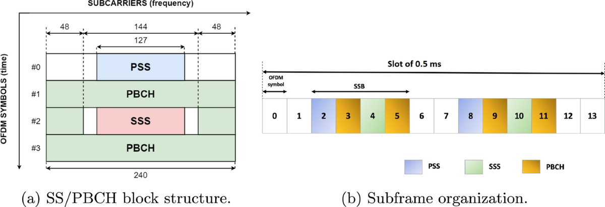

|[<<< Chapter 2](./Chapter2.md)|[Home](../README.md)|[Chapter 4 >>>](./Chapter4.md)|
|-|-|-|

# Chapter 3: Access related physical channels and signals

## 3.1. Synchronization Signals and Physical Broadcast Channel

||
|:-:|
|Synchronization Signals Block|

3.1.1. **SSB Components**: The combination of SS and PBCH forms the SSB in NR.
3.1.2. **Subcarrier Spacing**: SSB subcarrier spacing can be:
   - 15 or 30 kHz in FR1
   - 120 or 240 kHz in FR2
3.1.3. **UE Functions via SS Detection**: By detecting SS, a UE can:
   - Obtain physical cell identity
   - Achieve downlink synchronization (time and frequency)
   - Acquire timing for PBCH

||
|:-:|
|Primary Synchronization Signal and Secondary Synchronization Signal|

3.1.4. **NR SS Composition**: 
   - Primary SS (PSS)
   - Secondary SS (SSS)

|||
|:-:|:-:|
|PSS Sequence Generation|SSS Sequence Generation|

3.1.5. **Sequence Modulation**: 
   - NR PSS: BPSK modulated m-sequence of length 127
   - NR SSS: BPSK modulated Gold sequence of length 127
3.1.6. **Cell Identity Indication**: PSS and SSS together indicate up to 1008 different physical cell identities.
3.1.7. **SSB Mapping**: 
   - Time domain: 4 OFDM symbols
   - Frequency domain: 240 contiguous subcarriers (20 RBs)
3.1.8. **Beamforming and SS Burst Set**: 
   - Supports beamforming for initial access via SS burst set and beam sweeping
   - Multiple SSBs transmitted in a localized burst set with a periodicity default of 20 ms
   - Up to 64 SSBs can be transmitted in different beams within a 5 ms window
3.1.9. **SSB Timing and Frequency Location**: 
   - SSB time locations within an SS burst set are determined by numerology and frequency band
   - SSB frequency location configured by higher layer parameters, not necessarily at system bandwidth center
   - Sparser search raster for SSB detection compensates for increased search time due to sparser periodicity.

## 3.2. Physical Random Access Channel
||
|:-:|
|Physical layer processing for 5G NR PDSCH and PUSCH|

3.2.1. **Purpose of PRACH**:
   - Transmits a random-access preamble from UE to gNB
   - Indicates a random-access attempt
   - Assists gNB in adjusting the uplink timing of the UE

3.2.2. **Zadoff-Chu Sequences**:
   - Used for generating NR random-access preambles
   - Properties: constant amplitude before and after DFT, zero cyclic auto-correlation, and low cross-correlation

3.2.3. **Sequence Lengths and Formats**:
   - **Long Sequence (Length 839)**:
     - Four preamble formats
     - Originated from LTE preambles
     - Targeted for large cell deployments
     - Used in FR1 with subcarrier spacing of 1.25 or 5 kHz

   - **Short Sequence (Length 139)**:
     - Nine different preamble formats
     - Targeted for small/normal cell and indoor deployments
     - Used in FR1 with subcarrier spacing of 15 or 30 kHz
     - Used in FR2 with subcarrier spacing of 60 or 120 kHz

3.2.4. **Design of Short Preamble Formats**:
   - Last part of each OFDM symbol acts as a CP for the next OFDM symbol
   - Length of preamble OFDM symbol equals the length of data OFDM symbols

3.2.5. **Benefits of New Short Preamble Design**:
   - Allows gNB receiver to use the same FFT for data and random-access preamble detection
   - More robust against time-varying channels and frequency errors due to multiple shorter OFDM symbols per PRACH preamble
   - Supports analog beam sweeping during PRACH reception, enabling the same preamble to be received with different beams at the gNB

## 3.3. Physical Shared Channels

||
|:-:|
|5G NR PDCCH and PUCCH|

### 3.3.1. Physical Downlink Shared Channel (PDSCH)

3.3.1.1. **Purpose**:
   - Transmission of DL user data
   - UE-specific higher layer information
   - System information
   - Paging

3.3.1.2. **Transport Block Processing**:
   - **Transport Block CRC**: Appended for error detection
   - **LDPC Base Graph Selection**: Two types supported:
     - Optimized for small transport blocks
     - Optimized for larger transport blocks
   - **Segmentation**: Transport block is segmented into code blocks
   - **Code Block CRC**: Attached to each code block
   - **LDPC Encoding**: Each code block is individually LDPC encoded
   - **Rate Matching**: Each LDPC coded block is individually rate matched
   - **Code Block Concatenation**: Concatenated to create a codeword for transmission on PDSCH
   - **Simultaneous Transmission**: Up to 2 codewords can be transmitted simultaneously

3.3.1.3. **Modulation and Mapping**:
   - **Scrambling and Modulation**: Contents of each codeword are scrambled and modulated to generate complex-valued modulation symbols
   - **MIMO Layers**: Symbols are mapped on up to 4 MIMO layers
     - PDSCH can have two codewords to support up to 8-layer transmission
   - **Antenna Ports**: Layers are mapped to antenna ports in a specification transparent manner (non-codebook based)
     - Beamforming or MIMO precoding operation is up to network implementation and transparent to the UE
   - **Resource Blocks (RBs)**: Symbols are mapped to RBs for each antenna port used for PDSCH transmission

3.3.1.4. **Unavailable Resources Notification**:
   - UE can be informed of unavailable resources for PDSCH
   - Unavailable resources may include configurable rate matching patterns with RB and symbol-level granularity or RE-level granularity
   - This facilitates forward and backward compatibility, especially when NR and LTE share the same carrier

3.3.1.5. **Physical Layer Processing**:
   - Summarized in the left part of Figure 4

### 3.3.2. Physical Uplink Shared Channel (PUSCH)

3.3.2.1. **Purpose**:
   - Transmission of UL shared channel (UL-SCH)
   - Layer 1/2 control information

3.3.2.2. **Transport Block Processing**:
   - Similar to the processing of a DL transport block (as summarized in the right part of Figure 4)

3.3.2.3. **Modulation and Mapping**:
   - **Scrambling and Modulation**: Contents of the codeword are scrambled and modulated to generate complex-valued modulation symbols
   - **Layer Mapping**: Symbols are mapped onto one or several layers
     - PUSCH supports a single codeword that can be mapped up to 4 layers
   - **DFT Transform Precoding**: Optionally applied for single layer transmission if enabled
   - **Antenna Ports**:
     - Non-codebook-based and codebook-based transmission supported in the UL
     - Symbols are mapped to RBs for each antenna port used for the physical channel
   - **Mapping Order**: Mapping is done in frequency before time to enable early decoding at the receiver

|[<<< Chapter 2](./Chapter2.md)|[Home](../README.md)|[Chapter 4 >>>](./Chapter4.md)|
|-|-|-|