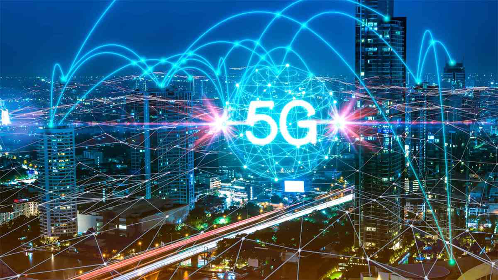

# 5G NR Research
The next generation of wireless communication, 5G or New Radio (NR)

#### Abstract
*The next generation of wireless communication, 5G or New Radio (NR), offers ubiquitous access to information for diverse users and applications. The Physical Uplink Control Channel (PUCCH) is crucial in NR for transmitting Uplink Control Information (UCI). Unlike Long Term Evolution (LTE), NR features a more flexible PUCCH structure to support various applications. This repository discusses the design principles of NR PUCCH formats and their physical structures.*

## [Chapter 1](./Chapters/Chapter1.md)
## [Chapter 2](./Chapters/Chapter2.md)
## [Chapter 3](./Chapters/Chapter3.md)

## [Uplink](./UPLINK/README.md)