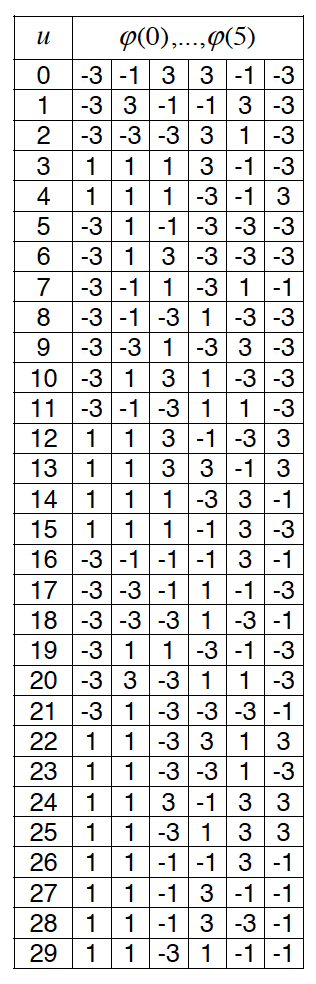
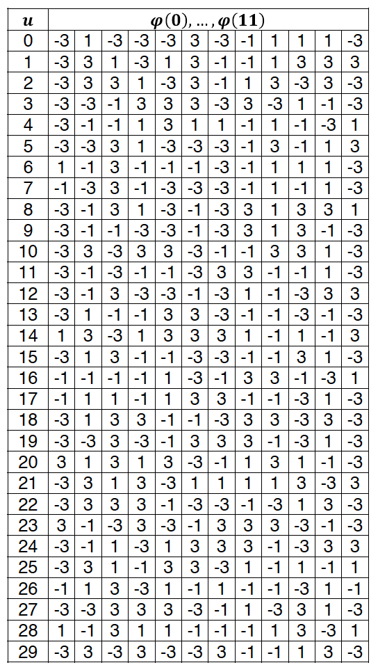
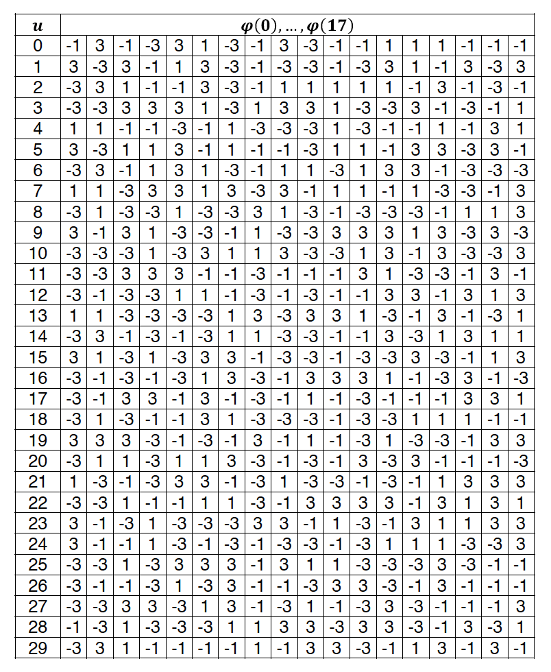
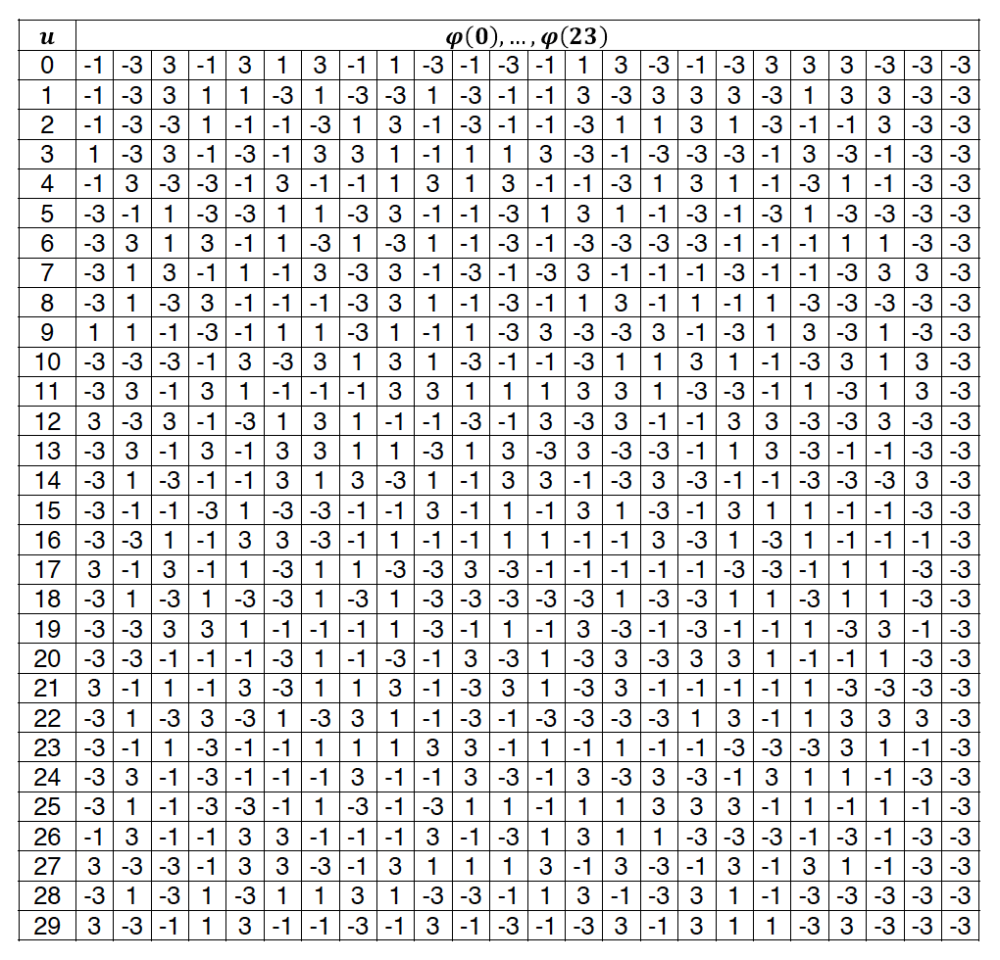
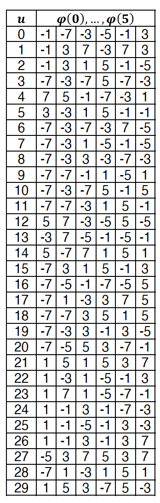
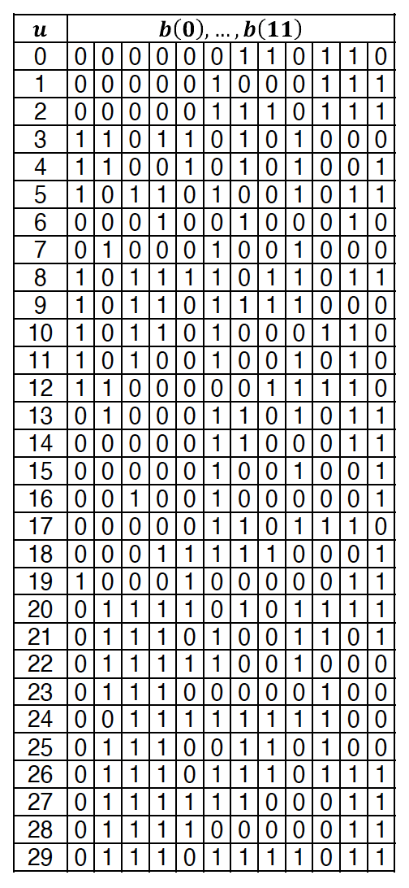
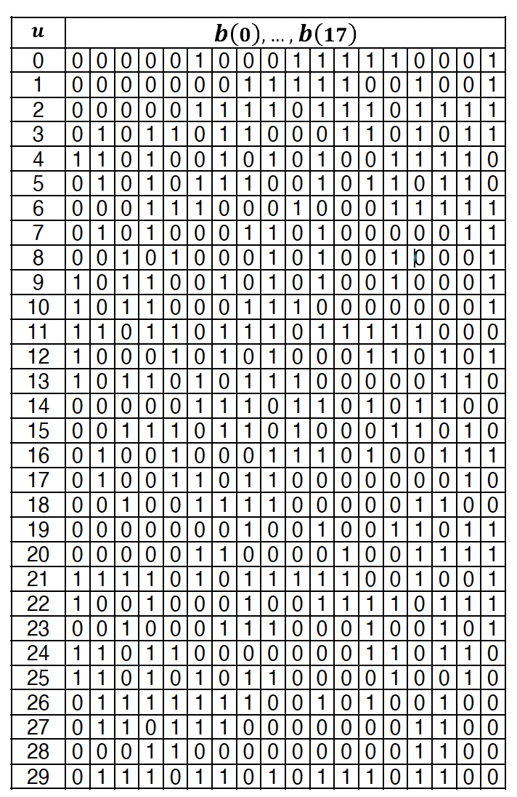
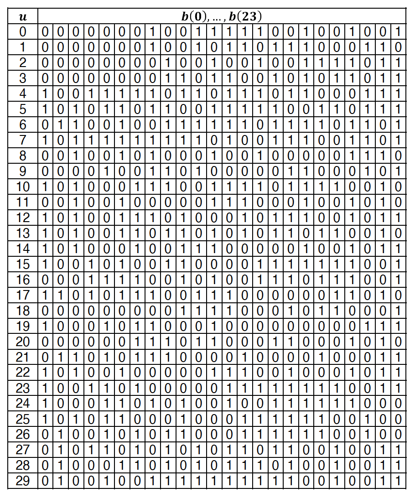

## 5 Generic functions

### 5.1 Modulation mapper

### 5.2 Sequence generation

#### <h4 id="Pseudo-random-sequence-generation"> 5.2.1 Pseudo-random sequence generation</h4>

Generic pseudo-random sequences are defined by a length-31 Gold sequence. The output sequence *c(n)* of length *MPN* where *n* = 0, 1,... , *MPN - 1* is defined by:

*c(n) = (x1(n + NC) + x2(n + NC)) mod 2*

x1(n + 31) = (x1(n + 3) + x1(n)) mod 2

x2(n + 31) = (x2(n + 3) + x2(n + 2) + x2(n + 1) + x2(n)) mod 2

Where *NC* = 1600 and the first m-sequence *x1(n)* shall be initialized with *x1(0)* = 1, *x1(n)* = 0, n = 1, 2,... , 30.

The initialization of the second m-sequence *x2(n)*, is denoted by *cinit* = $\sum_{i=0}^{30}$ *x2(i)*.2i with the value depending on the application of the sequence.

#### <h4 id="Low-PAPR-sequence-generation-type-1"> 5.2.2 Low-PAPR sequence generation type 1</h4>

The low-PAPR sequence }_{u,v})
is defined by a cyclic shift

of a base sequence
)
according to

}_{u,v}(n)=e^{j\alpha&space;n}.\bar{r}_{u,v}(n),0\le\text{}n<M_{ZC})

where

is the length of the sequence. Multiple sequences are defiend from a single base sequence through different values of
$\alpha$
and
$\delta$.

Base sequence
)
are devided into groups, where
$u\in\{0,1,...,29\}$
is the group number and *v* is the base sequence number within group such that each group contains one base sequence (*v* = 0) of each length

. The definition of the base sequence
,...\bar{r}_{u,v}(M_{ZC}-1))
depends on the sequence length
$M_{ZC}$
.

##### 5.2.2.1 Base sequences of length 36 or larger

For

, the base sequence
,...,\bar{r}_{u,v}(M_{ZC}-1))
is given by

=x_{q}(n\text{\space}mod\text{\space}N_{ZC}))

=e^{-j\frac{\pi\text{qm}(m+1)}{N_{ZC}}})

where

\rfloor+v.(-1)^{2\bar{q}})

/31)

The length $N_{ZC}$ is given by the largest prime number such that $N_{ZC} < M{ZC}$.

##### 5.2.2.2 Base sequences of length less than 36

For
 the base sequence is given by
=e^{j\varphi(n)\pi/4},0\le\text{}n\le\text{}M_{ZC}-1)

where the value of $\varphi(n)$ is given by Tables below:

||
|:-:|
|forM_{ZC}=6)|

||
|:-:|
|forM_{ZC}=12)|

||
|:-:|
|forM_{ZC}=18)|

||
|:-:|
|forM_{ZC}=24)|

#### 5.2.3 Low-PAPR sequence generation type 2

The low-PAPR sequence $r^{\alpha,\delta}_{u,v}(n)=\bar{r}_{u,v}(n),0\le\text{}n<M$

where $M=mN_{sc}^{RB}/2^{\delta}$ is the length of the sequence

Base sequence $\bar{r}_{u,v}(n)$ is divided into groups, where $u\in\{0,1,...,29\}$ is the group number and *v* is the base sequence number within the group, such that each group contains one base sequence (*v*=0) of length $M=mN_{sc}^{RB}/2^{\delta}$, $\frac{1}{2}\le\text{}\frac{m}{2^{\delta}}$. The sequence $\bar{r}_{u,v}(0),...\bar{r}_{u,v}(M-1)$ is defined by

$$\bar{r}_{u,v}(n)=\frac{1}{\sqrt{M}}\sum_{i=0}^{M-1}\tilde{r}_{u,v}(i)e^{-j\frac{2\pi\text{in}}{M}},n=0,...,M-1$$

where the definition of $\tilde{r}_{u,v}(i)$ depends on the sequence length

##### 5.2.3.1 Sequences of length 30 or larger

for $M\ge\text{}30$, the sequence $\tilde{r}_{u,v}(i)$ is obtained as the complex-valued modulations symbols resulting from $\pi/2$-BPSK modulation as defined in [5.2.1 Pseudo-random sequence generation](#Pseudo-random-sequence-generation), initialized with $c_{init}$.

##### 5.2.3.2 Sequences of length less than 30

For $M=6$,
$$\tilde{r}_{u,v}(i)=e^{j\varphi(i)\frac{\pi}{8}},0\le\text{}i\le\text{}M-1$$

where $\varphi(i)$ is given by:

||
|:-:|
|forM=6)|

For $M\in\{12,18,24\}$, the sequence $\tilde{r}_{u,v}(i)$ is obtained as the complex-valued modulations symbols resulting from π/2-BPSK modulation as defined in [clause 5.1.1]() applied to the binary sequence $b(i)$ given by Tables below:

||
|:-:|
|forM=12)|

||
|:-:|
|forM=18)|

||
|:-:|
|forM=24)|

### 5.3 OFDM baseband signal generation

### 5.4 Modulation and upconversion

## 6 Uplink

### 6.1 Overview

#### 6.1.1 Physical channels

Uplink physical channel corresponds to a set of resource elements carrying higher layers infomation.

Defined uplink physical channels:
- Physical Uplink Shared Channel (PUSCH)
- Physical Uplink Control Channel (PUCCH)
- Physical Random Access Channel (PRACH)

#### 6.1.2 Physical signals

Uplink physical signal is used by the physical layer but does not carry higher layers infomation.

Defined uplink physical signals:
- Demodulation reference signals (DM-RS)
- Phase-tracking reference signals (PT-RS)
- Sounding reference signal (SRS)

### 6.2 Physical resources

Defined antenna ports:
- Antenna ports starting with 0 for DM-RS for PUSCH
- Antenna ports starting with 1000 for SRS, PUSCH
- Antenna ports starting with 2000 for PUCCH
- Antenna ports 4000 for PRACH

### 6.3 Physical channels

#### 6.3.1 PUSCH

##### 6.3.1.1 Scranbling

##### 6.3.1.2 Modulation

##### 6.3.1.3 Layer mapping

##### 6.3.1.4 Transform precoding

##### 6.3.1.5 Precoding

##### 6.3.1.5 Mapping to virtual resource blocks

##### 6.3.1.5 Mapping from virtual resource blocks

#### 6.3.2 PUCCH

##### 6.3.2.1 General

PUCCH supported formats:

|PUCCH format|Length in OFDM symbols $N^{PUCCH}_{symb}$|Number of bits|
|:-:|:-:|:-:|
|0|1-2|≤2|
|1|4-14|≤2|
|2|1-2|>2|
|3|4-14|>2|
|4|4-14|>2|

##### 6.3.2.2 Sequence and cyclic shift hopping

PUCCH formats 0, 1, 3 and 4 use [sequences $r^{(\alpha, \delta)}_{u, v}$](#Low-PAPR-sequence-generation-type-1) with *δ* = 0 where the sequence group *u* and the sequence number *v* depend on the [sequence hopping](#group-and-sequence-hopping) and the cyclic shift *α*.
depends on the [cyclic shift hopping](#cyclic-shift-hopping).

###### <h6 id="group-and-sequence-hopping"> 6.3.2.2.1 Group and sequence hopping</h6>

The sequence group *u* = (*fgh* + *fss*) mod 30 and the sequence number *v* within the group depends on the higher-layer parameter *pucch-GroupHopping*:
- if *pucch-GroupHopping* equal 'neither' $$f_{gh}=0$$ $$f_{ss}=n_{ID}\ mod\ 30$$ $$v=0$$
where $n_{ID}$ is given by the higher-layer parameter *hoppingId* if congigured, otherwise $n_{ID}=N^{cell}_{ID}$

- if *pucch-GroupHopping* equal 'enable' $$f_{gh}=0$$ $$f_{ss}=n_{ID}\ mod\ 30$$ $$v=c(2n^{\mu}_{s,f}+n_{hop})$$
where the pseudo-random sequence *c(i)* is defined by [THIS](#Pseudo-random-sequence-generation) and shall be initialized at the beginning of each radio frame with $c_{init}=2^{5}\lfloor n_{ID}/30\rfloor+(n_{ID}\ mod\ 30)$ where $n_{ID}$ is given by the higher-layer parameter intraSlotFrequencyHopping. If frequency hopping is enabled by the higher-layer parameter
intraSlotFrequencyHopping, $n_{hop}=0$ for the first hop and $n_{hop}=1$ for the second hop.

###### <h6 id="cyclic-shift-hopping"> 6.3.2.2.2 Cyclic shift hopping</h6>

The cyclic shift $\alpha$ varies as a function of the symbol and slot number according to
)\text{\space}mod\text{\space}N^{RB}_{sc}))

where:
- $n^{\mu}_{s,f}$ is the slot number in the radio frame
- *l* is the OFDM symbol number in the PUCCH transmission (*l* = 0 corresponds to the first OFDM symbol)
- $m_{0}$ is given by [TS 38.213](../Docs/5G%20NR%20Standards/ETSI%20TS%20138%20213%20V18.2.0%20(2024-05).pdf) for PUCCH format 0 and 1 while for format 3 and 4 is defined in [6.4.1.3.3.1 Sequence generation](#Sequence-generation)
- $m_{cs}=0$ except for PUCCH format 0 when it depends on the information to be transmitted according to 9.2 of [TS 38.213](../Docs/5G%20NR%20Standards/ETSI%20TS%20138%20213%20V18.2.0%20(2024-05).pdf)
- $m_{int}$ is given by:
    - $m_{int}=5n_{lRB}^{\mu}$ for PUCCH format 0 and 1 if PUCCH shall use interlaced mapping according to any of the higher-layer parameters *useInterlacePUCCH-PUSCH* in *BWP-UplinkCommon* or *useInterlacePUCCH-
    PUSCH* in *BWP-UplinkDedicated*, where $n_{lRB}^{\mu}$ is the resource block number within the interlace
    - $m_{int}=0$ otherwise

The function $n_{cs}(n_c,l)$ is given by
$$n_{cs}(n_c,l) = \sum_{m=0}^{7}(2^mc(8N_{symb}^{slot}n_{s,f}^{\mu}+8l+m))$$
where the pseudo-random sequence *c(i)* is defined by **5.2.1**. The pseudo-random sequence generator shall be initialized with $c_{init}=n_{ID}$, where $n_{ID}$ is given by the higher-layer parameter *hoppingId* if configured, otherwise $n_{ID}=N_{ID}^{cell}$.

###### <h6 id="Block-wise-spreading">6.3.2.6.3 Block-wise spreading</h6>

###### 6.4.1.3.3 Demodulation reference signal for PUCCH formats 3 and 4

###### *<h6 id="Sequence-generation">6.4.1.3.3.1 Sequence generation</h6>*

The reference-signal sequence $r_{l}(m)$ shall be generated according to
$$r_{l}(m) = r_{u,v}^{(\alpha,\delta)}$$
$$m=0,1,...,M_{sc}^{PUCCH, s}-1$$
where $M_{sc}^{PUCCH, s}$ is given by [6.3.2.6.3 Block-wise spreading](#Block-wise-spreading) and 􀀀 , 
 ,  ( ) depends on the configuration: - if the higher-layer parameter dmrs-UplinkTransformPrecodingPUCCH is configured, and '⁄2-BPSK is used for PUCCH, 􀀀 , 
 ,  ( ) is given by clause 5.2.3 with (= 0 and  init given by clause 6.4.1.3.2.1. The sequence group ) and the sequence number * depend on the sequence hopping in clause 6.3.2.2.1. - otherwise, for PUCCH format 3, PUCCH format 4 with 
RB
PUCCH, =1, and PUCCH format 4 with 
RB
PUCCH, >1
when '⁄2-BPSK is not used for PUCCH, 􀀀 , 
 ,  ( ) is given by clause 6.3.2.2 and the cyclic shift + varies with
the symbol number and slot number according to clause 6.3.2.2.2 with -    = 0 for PUCCH format 3 without interlaced mapping; -    obtained from Table 6.4.1.3.3.1-1 with the orthogonal sequence

